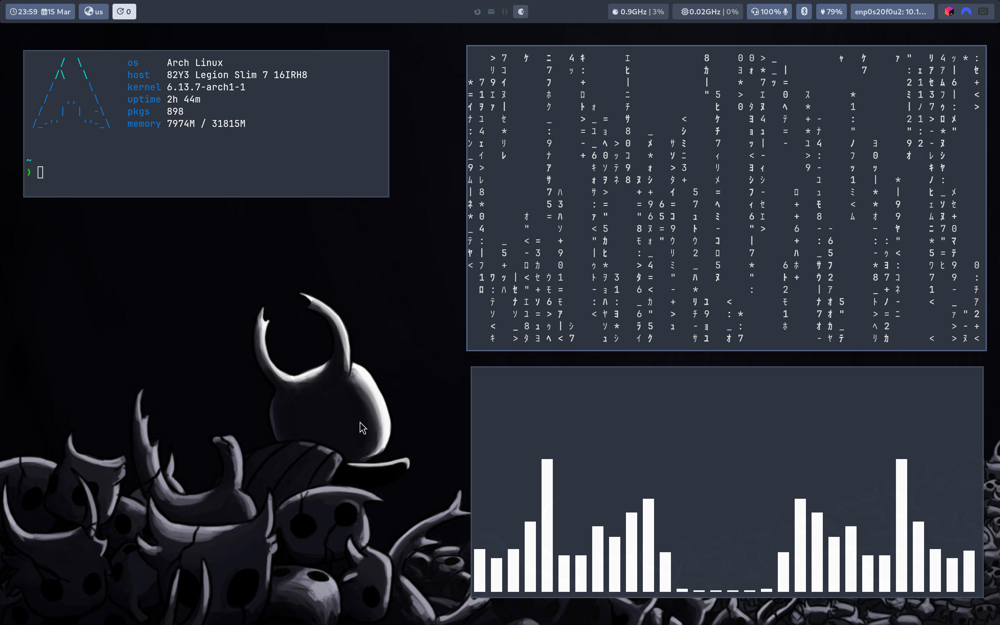
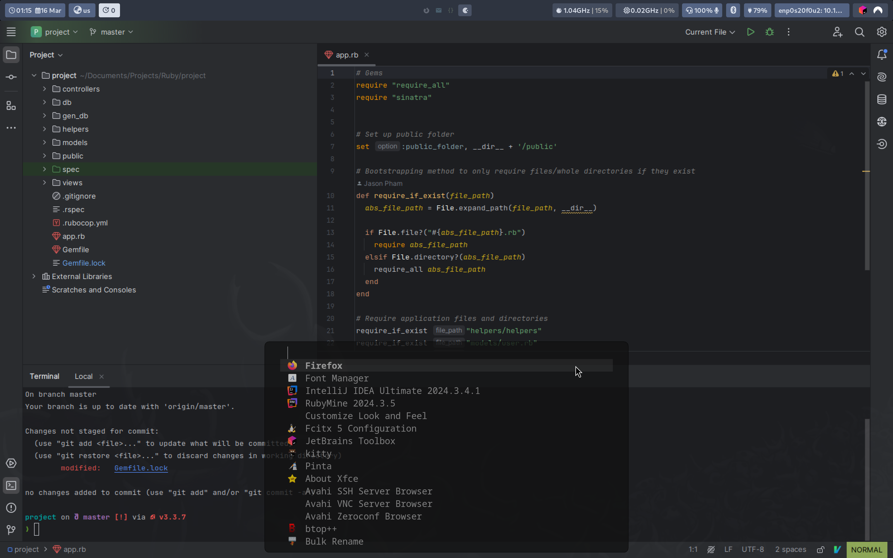
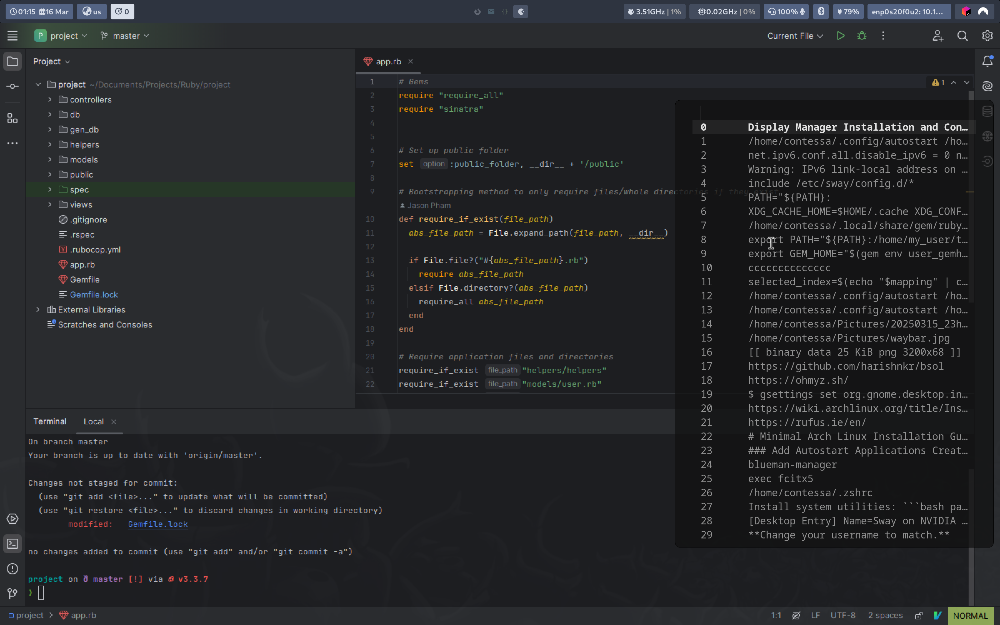
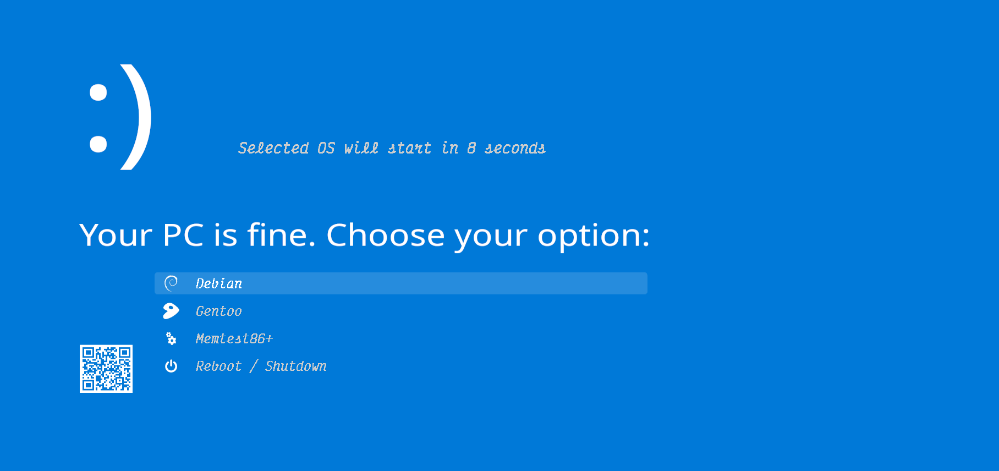

# Complete Sway Desktop Environment Setup Guide

This document outlines the (mostly) complete process of setting up my minimal [Sway](https://github.com/swaywm/sway)-based DE on Arch Linux, from installation to configuration and customization.
A lot of the settings are specific to NVIDIA GPUs, so use common sense when applying commands.

## Table of Contents
- [System Installation](#system-installation)
- [Display Manager Installation](#display-manager-installation-and-configuration)
- [Desktop Environment](#desktop-environment)
- [Development Environment](#development-environment)
- [Fonts and Themes](#fonts-and-themes)
- [Input Method Configuration](#input-method-configuration)
- [Utilities and Tools](#utilities-and-tools)
- [Applications](#applications)
- [System Management](#system-management)
- [Final Touches and Customization](#final-touches-and-customization)

## System Installation

Start with a basic Arch Linux installation:

### <<< EXTREMELY IMPORTANT: USE THE <a href="https://wiki.archlinux.org/title/Installation_guide">ARCH WIKI</a> >>>
#### << THE FOLLOWING IS A QUICK REFERENCE GUIDE FOR MYSELF >>
# Minimal Arch Linux Installation Guide

This guide provides step-by-step instructions for a minimal Arch Linux installation.

## 1. Preparation

### Download Arch Linux
1. Download the latest ISO from the [Arch Linux website](https://archlinux.org/download/)
2. Create a bootable USB drive:
   ```bash
   dd bs=4M if=/path/to/archlinux.iso of=/dev/sdX status=progress oflag=sync
   ```
   Replace `/path/to/archlinux.iso` with the path to your downloaded ISO and `/dev/sdX` with your USB drive.
   <br></br> Or use a tool like [Rufus](https://rufus.ie/en/) to write the image to a USB.

### Boot from USB
1. Insert the USB drive into the target computer
2. Boot from the USB drive (you may need to change boot order in BIOS/UEFI)
3. Select "Arch Linux install medium" from the boot menu

## 2. Pre-Installation

### Verify Internet Connection
```bash
ping -c 3 archlinux.org
```

If using Wi-Fi:
```bash
iwctl
device list
# Replace wlan0 with whatever interface is listed above 
station wlan0 scan
station wlan0 get-networks
# Find and replace SSID with your Wi-Fi name
station wlan0 connect SSID
# Enter password when prompted
exit
```

### Update System Clock
```bash
timedatectl set-ntp true
```

### Partition the Disk
1. Identify your disk:
   ```bash
   lsblk
   ```

2. Create partitions (example for a UEFI system with a 512MB EFI partition and the rest as root). Consult the
[Arch Wiki](https://wiki.archlinux.org/title/Installation_guide) very carefully if you're not sure.
   ```bash
   # Replace the path with the correct disk. We will use sda as an example
   cfdisk /dev/sda
   ```

    - Create a new EFI partition of size 1GB
    - Change partition type to EFI
    - Create root partition of preferred size
    - Change partition type to linux filesystem (default)
    - Write changes and exit
   

3. Format the partitions (**these are examples**):
   ```bash
   mkfs.fat -F32 /dev/sda1
   mkfs.ext4 /dev/sda2
   ```

4. Mount the partitions:
   ```bash
   mount /dev/sda2 /mnt
   mkdir -p /mnt/boot/efi
   mount /dev/sda1 /mnt/boot/efi
   ```

## 3. Installation

### Install Essential Packages
```bash
pacstrap /mnt base linux linux-firmware base-devel intel-ucode nano
```

### Generate Fstab
```bash
genfstab -U /mnt >> /mnt/etc/fstab
```

### Chroot into the New System
```bash
arch-chroot /mnt
```

### Set Timezone
```bash
ln -sf /usr/share/zoneinfo/Region/City /etc/localtime
hwclock --systohc
```
Replace `Region/City` with your timezone (e.g., `Europe/London`).

### Configure Locale
1. Edit `/etc/locale.gen` and uncomment needed locales:
   ```bash
   nano /etc/locale.gen
   ```
   Uncomment `en_US.UTF-8 UTF-8` or your preferred locale.


2. Generate locales:
   ```bash
   locale-gen
   ```

3. Create locale.conf:
   ```bash
   echo "LANG=en_US.UTF-8" > /etc/locale.conf
   ```

### Configure Console Font (Optional)
```bash
# This is the largest font I could find
pacman -S terminus-font
echo "FONT=ter-v32b" > /etc/vconsole.conf
```

### Set Hostname 
*The contents here don't really matter, as long as they are there*
```bash
# This will be the name of your computer to the outside a la ssh
echo "arch" > /etc/hostname
```
Replace `arch` with your preferred hostname.

### Configure Hosts File
```bash
nano /etc/hosts
```
Add these lines:
```
127.0.0.1   localhost
::1         localhost
127.0.1.1   arch.localdomain arch
```
Replace `arch` with your hostname.

### Set Root Password
```bash
passwd
```

### Install Basic Packages
```bash
pacman -S networkmanager sudo vim
```

### Configure Boot Loader
For UEFI systems:
```bash
pacman -S grub efibootmgr
grub-install --target=x86_64-efi --efi-directory=/boot/efi --bootloader-id=GRUB
grub-mkconfig -o /boot/grub/grub.cfg
```

### Enable Network Manager
```bash
systemctl enable NetworkManager
```

## 4. User Configuration

### Create a User
```bash
useradd -m -G wheel -s /bin/bash username
```
Replace `username` with your preferred username.

### Set User Password
```bash
passwd username
```
Replace `username` with your username.

### Configure Sudo
```bash
EDITOR=nano visudo
```
Uncomment the line: `%wheel ALL=(ALL) ALL`

## 5. Finishing Up

### Exit and Reboot
```bash
exit
umount -R /mnt
reboot
```

## 6. Post-Installation

Log in with your user account and:

### Connect to the Network
```bash
# NM should already be running, first line might not be needed
sudo systemctl start NetworkManager
nmtui
```

### Update the System
```bash
sudo pacman -Syu
```

### Install Additional Packages as Needed
```bash
pacman -S man-db man-pages texinfo tldr nano vim neovim wget git htop less ripgrep fd fzf jq tree-sitter-cli
```

Set up user directories:

```bash
# This will create user directories i.e. Pictures, Videos, Downloads etc.
pacman -S xdg-user-dirs
xdg-user-dirs-update
```

## Display Manager Installation and Configuration

Install and configure SDDM:

```bash
pacman -S sddm
systemctl enable sddm
```

<a href="">Eucalyptus Drop Theme</a> instructions for theme install and dependencies, 
but use the folder in my repository instead, under `dotfiles/eucalyptus-drop`.

## Desktop Environment

Install Sway and its core components:

```bash
pacman -S sway swaybg swayidle swaylock xorg-xwayland wl-clipboard
```

### Status Bar and Menu

```bash
pacman -S waybar fuzzel
```

### Terminal Emulator

```bash
pacman -S kitty
```

### Notification Daemon

```bash
pacman -S mako
```

### Screen Capture and Brightness Control

```bash
pacman -S grim slurp brightnessctl
```

## Audio Setup

Install PipeWire and audio control tools:

```bash
pacman -S pipewire-pulse pavucontrol
```

## Bluetooth Configuration

Install Bluetooth packages and tools:

```bash
pacman -S bluez bluez-utils blueman bluetui
systemctl enable bluetooth
```

## Development Environment

### Shell Setup

```bash
pacman -S zsh zsh-completions starship tmux
chsh -s /usr/bin/zsh
```

### Programming Languages and Development Tools

```bash
# Python
pacman -S python-pip python-dbus

# JavaScript/Node.js
pacman -S nodejs npm

# Java
pacman -S jdk-openjdk java-environment-common java-runtime-common

# Ruby
pacman -S ruby rubygems

# PHP
pacman -S php composer

# Rust
pacman -S rust

# Julia
pacman -S julia

# .NET
pacman -S dotnet-runtime dotnet-sdk

# Lua
pacman -S luarocks
```

### Development Tools
### AUR

```bash
git clone https://aur.archlinux.org/yay.git
cd yay
makepkg -si
```

```bash
yay -S code lazygit jetbrains-toolbox
```

### Qt Libraries

```bash
pacman -S qt5 qt6
```

### KDE Development Libraries

```bash
pacman -S kirigami kdeclarative kcmutils ksvg
```

## Fonts and Themes

Install necessary fonts:

```bash
pacman -S noto-fonts noto-fonts-cjk noto-fonts-emoji noto-fonts-extra
          ttf-dejavu ttf-liberation ttf-jetbrains-mono-nerd ttf-font-awesome
          font-manager
```
Then, use font-manager > Hamburger menu top right > Preferences > Desktop > Set all 3 font types as you wish.
I personally use Cantarell and JetBrains Mono Nerd.
<br>
<hr>

Install themes: (Will install Adwaita-dark, use lxappearance to customize)

```bash
pacman -S gnome-themes-extra lxappearance
gsettings set org.gnome.desktop.interface gtk-theme 'Adwaita-dark'
gsettings set org.gnome.desktop.interface color-scheme 'prefer-dark'
```

## Input Method Configuration

Set up fcitx5 for input method support:

```bash
pacman -S fcitx5 fcitx5-configtool fcitx5-chinese-addons
```

Configure environment variables in `.config/sway/config` with `export` commands:


## Utilities and Tools

Install additional utilities:

```bash
pacman -S bottom btop cava eza fastfetch tldr bat bc gnome-keyring polkit-gnome 
          gvfs ffmpegthumbnailer
```

## Applications

Install commonly used applications:

```bash
pacman -S firefox vlc thunar thunar-volman tumbler obs-studio pinta qimgv
```

## System Management

Configure NVIDIA drivers for GPU support:

It is very important to either use my sway config or export the variables there
yourself in order for the nvidia drivers to not ruin your day.

```bash
pacman -S nvidia nvidia-utils nvidia-settings lib32-nvidia-utils
```

In addition edit and change this line in `/etc/default/grub`:

`GRUB_CMDLINE_LINUX_DEFAULt="loglevel=3 nvidia-drm.modeset=1"`

Create a file in `/usr/share/wayland-sessions/` called `sway-nvidia.desktop` and 
paste the following. (Reference file is in `dotfiles/sway/wayland-sessions`)

```
[Desktop Entry]
Name=Sway on NVIDIA
Comment=Sway compositor with NVIDIA settings
Exec=/home/username/.config/sway/start-sway.sh
Type=Application
```
**Change your username to match.** Then finally:

`sudo grub-mkconfig -o /boot/grub/grub.cfg`

## Install system utilities:
Needed to mount windows filesystems

```bash
pacman -S ntfs-3g mesa-utils
```

## Final Touches and Customization
Get the rest of the packages by installing from a list stored in the `packages` file

```bash
cd dotfiles
yay -S --needed - < packages
```

If you haven't already, copy and paste the entire contents of the repository to `~/.config/` 

You should get the following setup if you copied the files and followed the guide to
this point:




*a simple no nonsense setup*

### Fuzzel Configuration:
There are light and dark modes for the app launcher.

Change this line in `dotfiles/fuzzel/clipboard-fuzzel.sh`
```bash
# Replace fuzzel-clip.ini with fuzzel-clip-light.ini
selected_index=$(echo "$mapping" | cut -f1,3 | fuzzel --dmenu --config=$HOME/.config/fuzzel/fuzzel-clip.ini | awk '{print $1}')

# Replace this line in sway/config
$file = fuzzel
# with
$file = fuzzel --config=$HOME/.config/fuzzel/fuzzel-light.ini
```

### Sway Configuration

Edit the config to your preferences (run `man 5 sway` for detailed instructions on each setting) :

```bash
# Set background
exec swaybg -i /path/to/your/wallpaper.jpg -m fill

# Configure input devices
input type:keyboard {
    xkb_layout us
    xkb_options caps:escape
}

input type:touchpad {
    tap enabled
    natural_scroll enabled
}

# Configure your displays
output * bg /path/to/your/wallpaper.jpg fill
```

### Add Autostart Applications

Create a script to launch applications at startup:

```bash
mkdir -p ~/.config/autostart
echo '[Desktop Entry]
Type=Application
Name=Polkit GNOME
Exec=/usr/lib/polkit-gnome/polkit-gnome-authentication-agent-1
Terminal=false
Hidden=false
' > ~/.config/autostart/polkit-gnome.desktop

echo '[Desktop Entry]
Type=Application
Name=Fcitx5
Exec=fcitx5
Terminal=false
Hidden=false
' > ~/.config/autostart/fcitx5.desktop
```

### Create a zsh config
Upon changing shells, you should've done an initial `.zshrc` configuration. 
Consider using [oh-my-zsh](https://ohmyz.sh/) for a shell appearance glow up.

### GRUB Configuration
I personally use [BSOL](https://github.com/harishnkr/bsol) as my theme. Follow the instructions
to install it at your own risk.



## Final System Check

Reboot and test your new DE!

```bash
reboot
```

After logging in, verify all components are working properly:
- Sway window manager functions (tiling, workspaces)
- Waybar displays correctly
- Terminal emulators work
- Applications launch properly
- Audio and Bluetooth work
- Input methods function

## Maintenance and Updates

Regularly update your system:

```bash
sudo pacman -Syu
```
